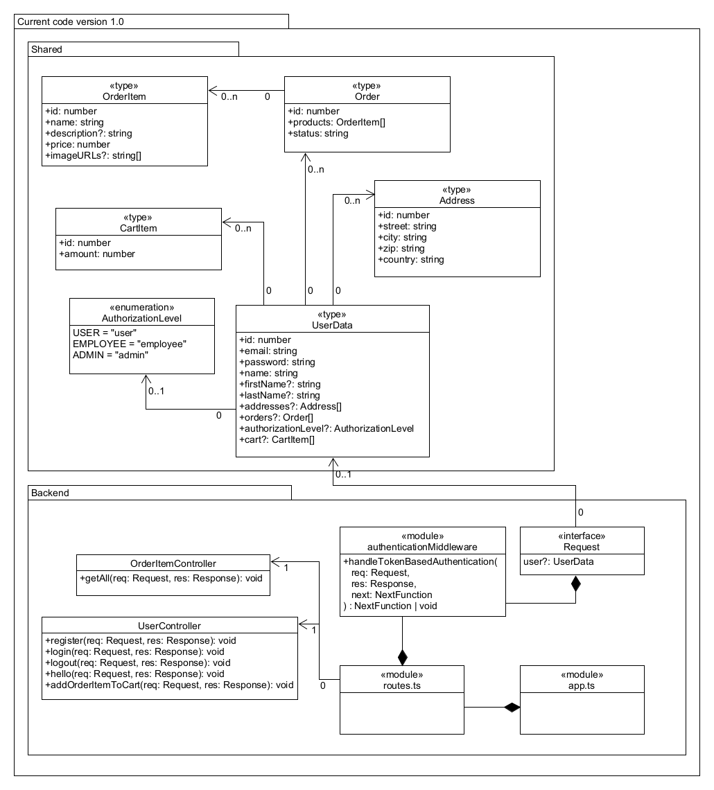
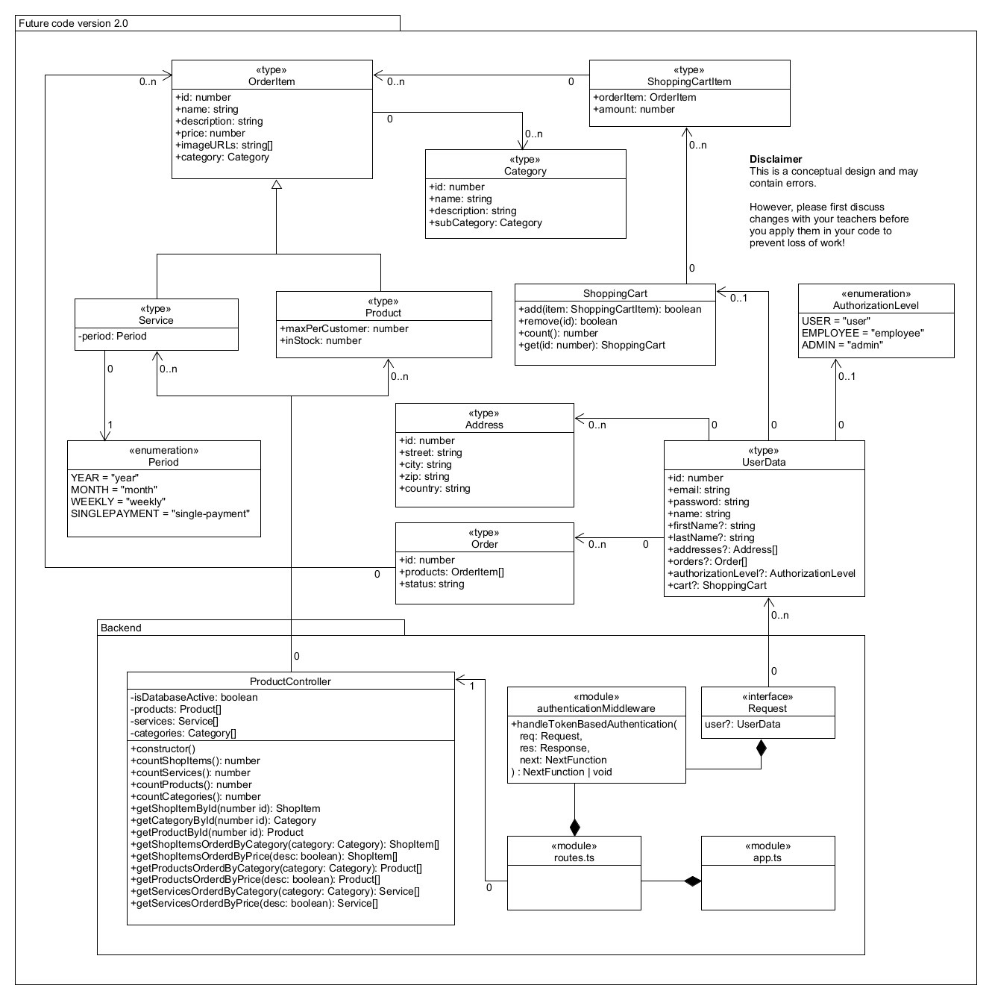

# Software design requirements
(Use this to demonstrate criterion k1 and k3.)

## Introduction
To ensure the code is maintainable and the server api is usable by different front-end applications, we have asked a solution architect to create a suitable design. Stan Manstan has been hired to do this. He promised us a fantastic, amazingly well working, easy maintainable and future-ready codebase for an unbelievable low-price. Regretfully we had to fire him, but luckily his work is mostly done.

We want you to to do the following while developing the webshop:
- use his design for resource mapping while creating endpoints.
- use his (partially finished) Class Diagram to ensure a maintainable codebase.

## API resource-mapping
This is the resource mapping version 1.1. 

```typescript
/shopping-cart/items/{id}

/store-content/all?orderBy=price&sortOrder=Asc

/store-content/all/{id}

/store-content/products?orderBy=price&sortOrder=Asc

/store-content/products/{id}

/store-content/services?orderBy=price&sortOrder=Asc

/store-content/services/{id}

/store-content/categories/{id}/all?orderBy=price&sortOrder=Asc

/store-content/categories/{id}/all/{id}

/store-content/categories/{id}/products?orderBy=price&sortOrder=Asc

/store-content/categories/{id}/products/{id}

/store-content/categories/{id}/services?orderBy=price&sortOrder=Asc

/store-content/categories/{id}/services/{id}
```

## Server classes
In the shared codebase there are certain `types` that ensure a shared JSON body is used between the server and the webclient. 

Please use these `types` while developing models or services in the server to communicate with the MySQL database. Within the server you should use controllers and design the router to work with these `types` as well. 

Please organize and document all the code according to TSDoc convention. Update the Class Diagram when applicable. 

## Class Diagram
### Explanation 
Below you can find two versions of the class diagram. One is an overview of the project in it's current state. The other is the version you should implement in the finished product. The second one regretfully was never finished. Please complete the design and update it when applicable. The source file is added in this folder as well

### Express and middleware
All requests arrive at the URLs specified in the router module. Between executing the function associated with the URL and receiving a request, other functions can be executed. This is called middleware. The LucaStars webshop uses one middleware function called authenticationMiddleware. This function uses JWT tokens, an industry standard. Feel free to discuss desired extra middleware with the C.T.O.. 

If the user is logged in, they receive a token. The authenticationMiddleware checks if this token is valid and retrieves the corresponding user data.

If the user considers buying a product this will be added to the cart on the server. The product id will be sent to the correct endpoint. The users JWT token is send along in the request header. With both the token and the product-id the server knows what to add to which cart.

### Types and enumerations
Almost every `type` in the class diagram can be directly converted into a table so that it can be placed in an ERD (Entity-Relationship Diagram). The diagram also specifies some enumerations. An `enumeration` contains a list of possibilities. 

If, for example, you want to create different types of users: the customer who can make purchases, an employee who can add new products, and an administrator who can update the software. When you look at the AuthorizationLevel enumeration, you will see these choices reflected there. There are three choices (User, Employee, and Admin). The same is true for the Period enumeration. Having this reflected in an enumeration makes proper translation from data to functionality easier. 

### Current version


### Future version

